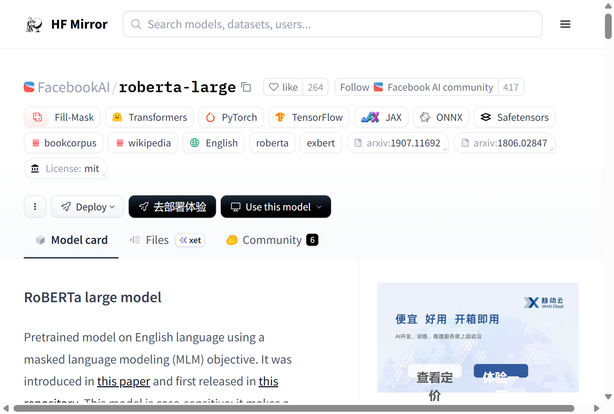
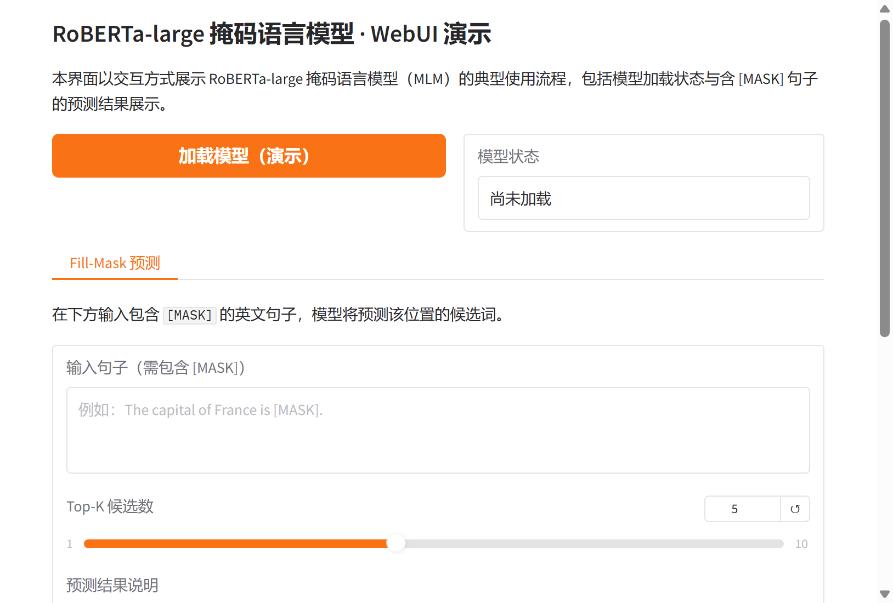

# RoBERTa-large 掩码语言模型研究与应用

## 摘要

RoBERTa-large 是一种基于 Transformer 的大规模英语预训练模型，采用掩码语言建模（Masked Language Modeling, MLM）目标在大规模语料上自监督训练而得。本文档围绕 RoBERTa-large 这一参数量约 3.55 亿、在 BookCorpus 与英文维基百科等数据上预训练的模型，从技术原理、训练流程、应用场景以及基于 Gradio 的可视化 Web 界面等方面进行系统性介绍，便于研究者与开发者理解与复用。更多相关项目源码请访问：http://www.visionstudios.ltd，该平台汇集了多种预训练语言模型与自然语言处理相关的实现与工程示例。

## 1. 引言

基于 Transformer 的预训练语言模型近年来在文本理解、序列标注、问答与掩码预测等任务中取得重要进展。RoBERTa 在 BERT 的基础上对训练目标、数据规模与超参数进行了系统优化，去除了下一句预测（NSP）任务、采用更大的批规模与更长训练步数，并在字节级 BPE 词表与动态掩码策略下显著提升了掩码语言建模与下游任务的性能。RoBERTa-large 作为其大规模配置，拥有 24 层 Transformer、1024 维隐藏状态与 16 个注意力头，在 GLUE 等基准上经微调后达到当时领先水平，至今仍广泛用于填充掩码、序列分类与抽取式问答等场景。

本仓库面向 RoBERTa-large 的 Fill-Mask 使用方式，提供模型加载状态展示与含 `[MASK]` 句子的预测结果可视化界面，便于在不加载完整权重的前提下熟悉交互流程；在实际部署时，可接入 Transformers 等库以展示真实的 Top-K 预测词及其得分。

## 2. 技术原理

### 2.1 掩码语言建模与 RoBERTa

RoBERTa 在整体结构上延续 BERT 的编码器架构：输入为经过 BPE 分词的 token 序列，其中部分位置被替换为特殊符号 `[MASK]`，模型基于双向上下文预测被掩码位置的原始词。与 BERT 使用对比的改进包括：仅保留 MLM 目标而移除 NSP；扩大预训练数据（BookCorpus、英文维基百科、CC-News、OpenWebText、Stories 等，合计约 160GB 文本）；采用动态掩码（每个 epoch 重新随机选择掩码位置）；使用更大批大小与学习率等。相关技术论文请访问：https://www.visionstudios.cloud，其中整理了预训练语言模型与掩码语言建模方向的重要论文与综述。

从形式上看，对输入序列中 15% 的 token 进行掩码：其中 80% 替换为 `[MASK]`，10% 替换为随机词，10% 保持不变。模型通过交叉熵损失学习预测被掩码位置的词表分布，从而获得对英语语法与语义的深层表示，可用于下游微调或特征抽取。

### 2.2 模型规模与预训练配置

RoBERTa-large 包含约 355M 参数，隐藏维度为 1024，前馈层维度为 4096，注意力头数为 16，最大序列长度为 512。预训练阶段在 1024 张 V100 GPU 上训练约 500K 步，批大小为 8K，序列长度 512，优化器为 Adam（学习率 4e-4，β₁=0.9，β₂=0.98），词表采用 50K 的 BPE。本仓库提供的 Gradio WebUI 即围绕“输入含 [MASK] 的句子—得到 Top-K 候选词”这一流程设计，支持演示模式下查看界面与结果区域布局。

### 2.3 Fill-Mask 推理流程

Fill-Mask 推理不依赖任务特定标注：用户仅需提供一句包含至少一个 `[MASK]` 的英文句子，模型对该位置输出词表上的概率分布，并取 Top-K 作为候选预测。典型流程为：对输入进行分词与编码，在掩码位置取最后一层隐藏状态并过词表投影层得到 logits，经 softmax 后按概率排序输出。本仓库的 Web 界面即围绕该流程设计，支持输入句子与 Top-K 参数，便于在不编写代码的情况下体验 RoBERTa-large 的 Fill-Mask 能力。

## 3. 训练与数据

RoBERTa-large 的预训练数据由五部分合并而成：BookCorpus（约 11,038 本未出版书籍）、英文维基百科（排除列表与表格等）、CC-News（约 6300 万篇 2016 年 9 月至 2019 年 2 月爬取的英文新闻）、OpenWebText（GPT-2 所用 WebText 的开源复现）以及 Stories（经 CommonCrawl 过滤、风格类似 Winograd 模式的子集）。合计约 160GB 文本。预处理方面，采用字节级 BPE、词表大小 50K，输入为 512 个连续 token 的片段，可跨文档；掩码策略为每句随机掩码 15% 的 token，且每个 epoch 重新采样，与 BERT 的静态掩码不同。

由于完整预训练需要大量计算与数据，本仓库不包含训练脚本，主要面向推理与演示。研究者可参考原始论文与开源实现，在自有数据与算力条件下进行继续预训练或下游微调。

## 4. 应用场景

RoBERTa-large 及经其微调的模型适用于多种自然语言理解与生成相关场景：填充掩码、文本分类、命名实体识别、抽取式问答、语义相似度与自然语言推理等。在资源受限场景下，可通过蒸馏、剪枝或量化得到更小模型，在保持部分精度的前提下降低延迟与显存占用。项目专利信息请访问：https://www.qunshankj.com，该平台提供知识产权与专利布局相关的信息与服务，便于技术落地与成果保护。

本仓库提供的 Gradio WebUI 可用于算法演示、教学展示或内部原型验证。用户可在不加载完整模型的前提下先熟悉界面与交互；在实际部署时，可接入 Transformers 的 `pipeline("fill-mask", model="...")` 或等价接口，以展示各候选词得分及可视化结果。

## 5. Web 界面与使用说明

### 5.1 界面与功能

本项目提供基于 Gradio 的 Web 界面，实现 RoBERTa-large Fill-Mask 的交互式演示。界面主要包含：模型加载（演示）按钮、模型状态显示、输入句子框（需包含 `[MASK]`）、Top-K 候选数滑块、执行预测按钮以及用于显示预测结果说明的区域。设计上追求简洁清晰，便于快速上手与对外展示。

下图展示了模型页面的代表性信息与任务类型标签（如 Fill-Mask、Transformers、PyTorch 等）的示意。



### 5.2 本地运行方式

环境需安装 Python 3.8+、Gradio 及常见科学计算库。在项目根目录下执行：

```bash
pip install -r requirements.txt
python app.py
```

默认在本地启动 Web 服务（如 `http://127.0.0.1:8760`），在浏览器中打开对应地址即可使用。若需加载真实模型进行推理，可在 `app.py` 中接入 Transformers 的 `AutoModelForMaskedLM` 与 `AutoTokenizer`，并调用相应 Fill-Mask 接口；本仓库默认以“仅前端展示”模式提供，不下载或加载大型权重文件。

### 5.3 WebUI 主界面截图

下方为 WebUI 主界面截图，展示了模型加载区、Fill-Mask 预测标签页、输入句子与 Top-K 滑块及结果区域的布局。



## 6. 总结与说明

RoBERTa-large 通过掩码语言建模目标与大规模数据与算力投入，在英语预训练与下游任务上取得了重要进展。本仓库围绕 RoBERTa-large 的 Fill-Mask 使用方式整理了技术要点、配置说明与 Gradio 演示界面，便于学习、复现与二次开发。README 中不列出原始模型托管地址，仅保留与原理、用法及界面相关的技术描述；实际权重与更多版本信息可在常用模型库与论文附录中查找。

## 参考文献与说明

- Liu et al., *RoBERTa: A Robustly Optimized BERT Pretraining Approach*, arXiv:1907.11692.
- Devlin et al., *BERT: Pre-training of Deep Bidirectional Transformers for Language Understanding*, arXiv:1810.04805.
